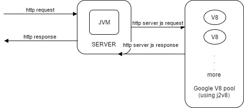

# EasyREST (Java + Javascript (Google V8 engine) Pool)

Using this java project we can write server script in javasctipt with and faster than NodeJs in terms of performance.

## Getting Started

Purpose of this project is fast & easy development and better perfaomance than Nodejs. Nodejs is good manny project built using Nodejs, but we knew Nodejs one threaded. Java has manny features and good written library.
So main goal of this project is use java + javasctip using cpu utilization , fast ans easy develoment of server side.


### Prerequisites

1. Java
2. Windwos, Mac, Linux or Android 

## Running the Example

1. Write server side Javascript (.js) in java resourse ``/v8/task`` directory. here example [Server/res/v8/task/api.js](Server/res/v8/task/api.js)
2. For Write server fuction we have to start function with ``this.``. example test function is ``this.test = function(args){...}``
3. Call function via ``AJAX`` . for ajax use [www/js/server.js](www/js/server.js).

example of call test function via ajax : [index.html](www/index.html)

```javascript
server.ajax({
            path: "api.js",
            name: "test",
            data: {
                name: "Pathik"
            },
            done: function (data) {
                console.log(data);
                //here data is "Hello Pathik"
            }
        });
```

## Flow of Project


## Built With

* [J2V8](https://github.com/eclipsesource/J2V8) - Java Bindings for V8
